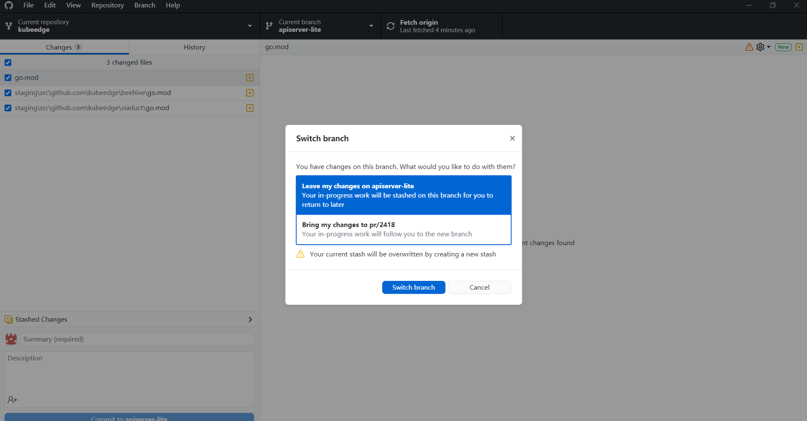
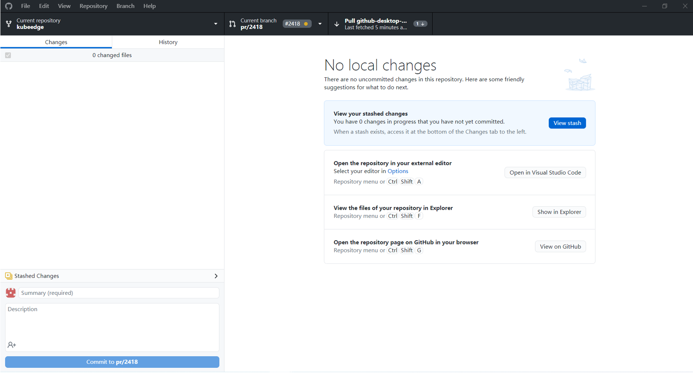
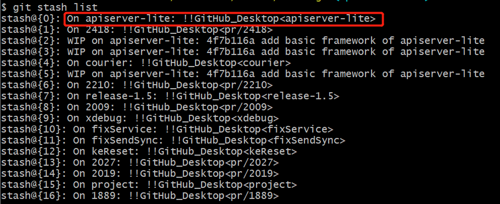
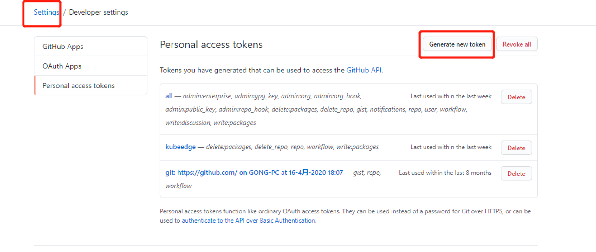
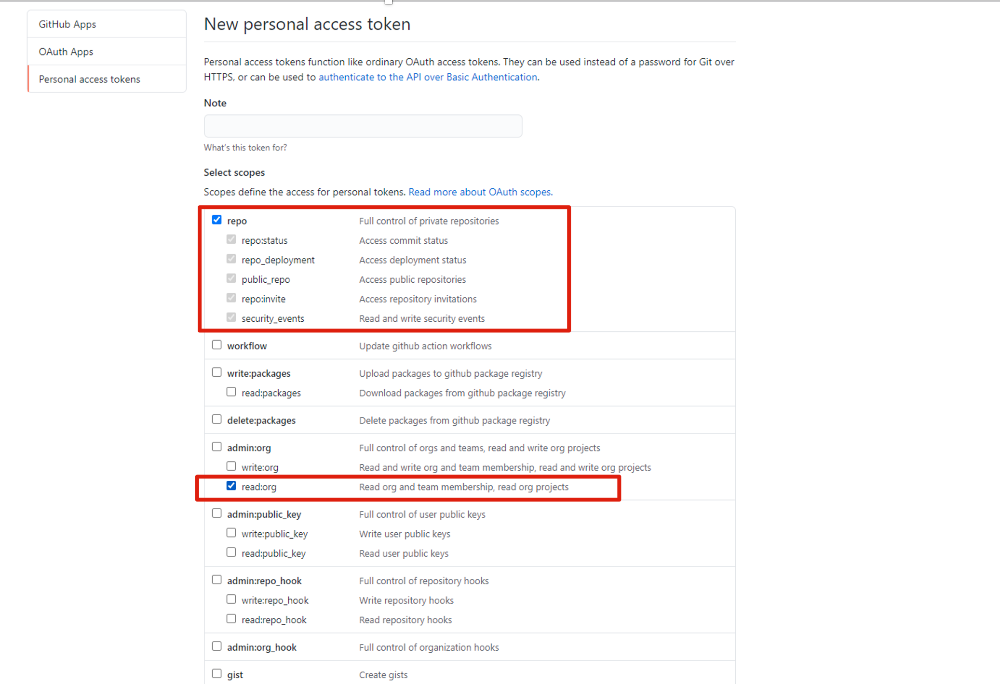
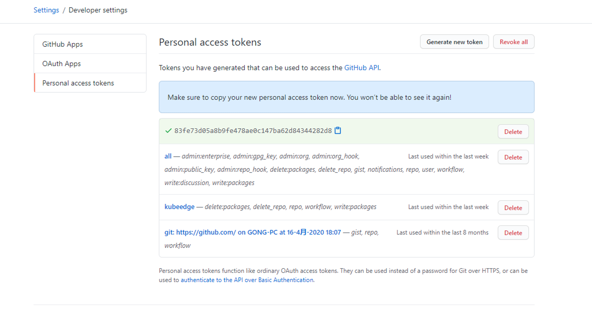
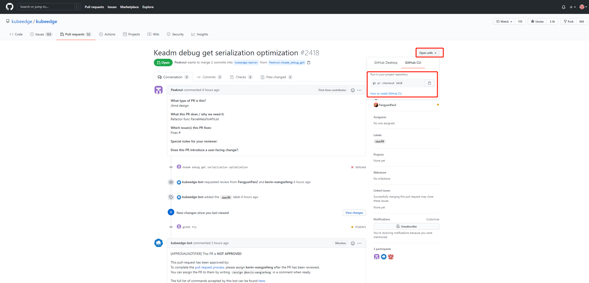

# How to quickly review the code of other people in the community and test it


## bashrc

https://github.com/GsssC/bashrc

学长的脚本, 便于bashrc配置（环境以及源码下载）


## （1）使用 git

### windows/Linux/Mac

1. 在原仓库中查看 issues ID

   

2. 在终端中查看仓库关系

   

3. 运行命令并切换分支

   ```bash
   git fetch upstream pull/ID/head:BRANCHNAME
   git checkout BRANCHNAME
   ```

   

   


## （2）使用 github cli

### Windows

Windows主要使用github desktop做代码开发, 假设有下图pr我们希望在本地观察它的源码!


1. 点开右上角Open with, 点开Open in Desktop

   

2. GitHub Desktop会自动启动, 加入原工作区有未保存的变更, 会通知进行stash



3. 选择将工作区stash后, switch branch, 可以看见分支已经切换 



4. 使用git stash list 可以看见刚才stash的内容




### Linux CentOS

1. 安装gh

```bash
yum install dnf dnf-plugins-core

sudo dnf config-manager --add-repo https://cli.github.com/packages/rpm/gh-cli.repo

sudo dnf install gh 
```

2. gh的使用需要github token, 进入settings/developer settings生成github token

   

3. gh使用的最小权限是repo + read:org



4. 生成后注意复制保存秘钥



5. 登录gh


输入刚才生成的token


6. 使用gh



将代码 gh pr checkout 2418 复制后在centos命令行内粘贴输入, 完成切换, 十分方便


 


### MAC 

（1）安装 gh

```bash
brew install gh
```

（2）相关配置


（3）使用 gh

```bash
# 如果 base repo 设置的是原始仓库
gh pr checkout 2418

# 如果 base repo 设置的是自己 fork 的仓库，需要指定 base repo
# base repo 的格式为"[HOST/]OWNER/REPO"，这里是kubeedge/kubeedge，
gh pr checkout -R kubeedge/kubeedge 241
```


